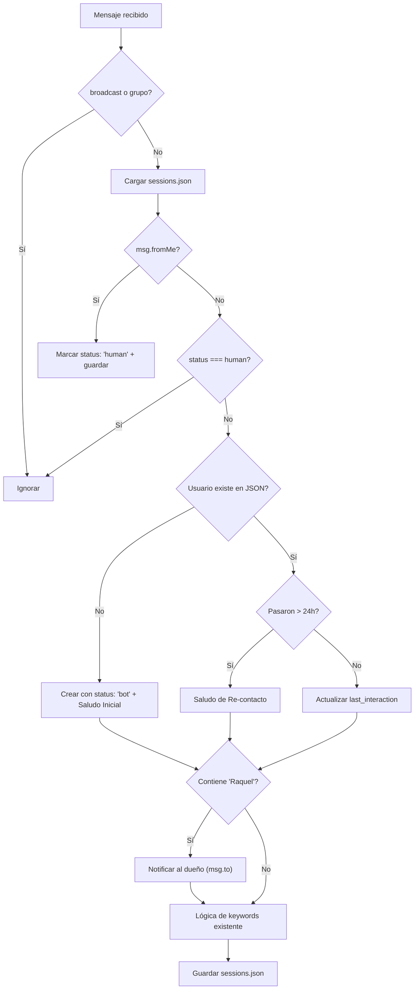

# Walkthrough: Sistema de Gestión de Sesiones

## Archivos creados/modificados

| Archivo | Acción | Descripción |
|---|---|---|
| [sessionManager.ts](file:///c:/Users/Andres/Documents/proyectos/proyecto-attclient/src/services/sessionManager.ts) | **NEW** | Módulo con [loadSessions()](file:///c:/Users/Andres/Documents/proyectos/proyecto-attclient/src/services/sessionManager.ts#22-35), [saveSessions()](file:///c:/Users/Andres/Documents/proyectos/proyecto-attclient/src/services/sessionManager.ts#36-42), interfaces y constante `TWENTY_FOUR_HOURS` |
| [sessions.json](file:///c:/Users/Andres/Documents/proyectos/proyecto-attclient/sessions.json) | **NEW** | Archivo JSON inicial vacío `{}` |
| [index.ts](file:///c:/Users/Andres/Documents/proyectos/proyecto-attclient/src/index.ts) | **MODIFIED** | Integración completa del sistema de sesiones en `client.on('message')` |

## Flujo lógico implementado



## Resumen de Cambios Completados

### Fase 1: Entorno de Desarrollo y Estáticos
- [x] Convertir `index.js` del backend a ES Modules o configurar el `package.json` de manera acorde (usamos CommonJS en un inicio pero terminamos usando `type: "module"`)
- [x] Configurar `tsc` para transpilar código TypeScript de Node
- [x] Configurar nodemon en modo watch para recargar el backend al editar el código

### Fase 2: Configuración de Firebase y Base de Datos (Firestore)
- [x] Añadida librería `firebase-admin` al servidor Express
- [x] Definido un esquema de datos en Firestore para `usuarios`, `bots`, y `metricas`
- [x] Modificadas las funciones de persistencia para leer/guardar directamente en Firebase

### Fase 3: Pasarela de Pagos (Mockup y Diseño base)
- [x] Creación de `src/services/paymentService.ts`
- [x] Implementar rutas ficticias para simular subscripciones (crear checkout y webhook mock)

### Fase 4: Frontend Principal (Migrado a Vite + React)
- [x] Se inicializó un proyecto unificado de React + Vite en la carpeta `landing/`
- [x] Se migró `index.html` estático a un diseño moderno de React con Tailwind (landing page en `Landing.tsx`)
- [x] Se migró el panel de administrador SaaS de Vanilla JS a React (`SaasDashboard.tsx`)
- [x] Se migró el panel de administrador del Bot de Vanilla JS a React (`BotAdmin.tsx`)
- [x] Se migró la página de Login unificada hacia React (`LoginView.tsx`)
- [x] Se configuraron rutas en App.tsx con protección de AuthState
- [x] Se actualizó `server.ts` del backend para servir únicamente los archivos estáticos desde `landing/dist` para todo salvo las rutas del `/api`.
- [x] Se eliminaron las carpetas `public/`, `admin/` y `users/` con los archivos HTML obsoletos.
- [x] Se actualizaron los scripts `npm run dev` y `npm run build` para usar `concurrently` y construir/servir conjuntamente el frontend y backend.

## Consideraciones técnicas

- **Timestamps**: Se usa `Math.floor(Date.now() / 1000)` para convertir ms → s y comparar con los timestamps de WhatsApp.
- **I/O asíncrono**: Se usan `fs.promises` para no bloquear el event loop.
- **Ruta del JSON**: Se resuelve con `path.resolve(__dirname, '../../sessions.json')` relativa al directorio del módulo compilado.

## Verificación

- ✅ `npm run build` — compilación exitosa sin errores de TypeScript.

---

## Actualización (29/06/2026): Estabilidad de Puppeteer, Logs de Comportamiento y Corrección de Deploy

### Cambios Realizados

| Archivo | Acción | Descripción |
|---|---|---|
| [BotInstance.ts](file:///Users/macbookpro/Documents/proyectos/bot-store/src/saas/BotInstance.ts) | **MODIFIED** | <ul><li>Restaurado el método `_patchLidResolution` para corregir error de TypeScript.</li><li>Aumentados los timeouts de Puppeteer (`timeout` a 120s, `protocolTimeout` a 300s).</li><li>Implementado contador de 3 intentos en el HealthCheck y silenciado de falsas alarmas de navegación (`Execution context was destroyed`).</li><li>Removido el reinicio automático del bot desde estado humano (desactivado timer de 30m y reseteo por inactividad de 24h).</li><li>Añadidos logs de comportamiento detallados de mensajes entrantes y salientes (etiquetados con `[BEHAVIOR]`).</li><li>Actualizado `resolveToCanonicalContactId` para evaluar un script en el navegador que obtiene el JID LID real sin enmascarar (evitando que WWebJS lo sobrescriba de vuelta a `@c.us`), resolviendo y enviando mensajes correctamente al LID del destinatario.</li></ul> |
| [botLogger.ts](file:///Users/macbookpro/Documents/proyectos/bot-store/src/services/botLogger.ts) | **MODIFIED** | Modificado `logMessage` para registrar únicamente la longitud de los mensajes entrantes (`BodyLength`) y no el texto sin procesar, manteniendo la privacidad de la información. |
| [package.json](file:///Users/macbookpro/Documents/proyectos/bot-store/package.json) | **MODIFIED** | Añadido el hook de ciclo de vida `prestart` (`npm run build`) para garantizar que tanto frontend como backend se compilen al ejecutar `npm start` (deploy regular en VPS). |
| [index.ts](file:///Users/macbookpro/Documents/proyectos/bot-store/src/index.ts) | **MODIFIED** | Registrado manejador de señales `SIGINT` (Ctrl+C) y `SIGTERM` para apagar limpiamente todos los navegadores de Puppeteer en salida del proceso. |
| [BotManager.ts](file:///Users/macbookpro/Documents/proyectos/bot-store/src/saas/BotManager.ts) | **MODIFIED** | Añadido método `stopAll()` para detener en paralelo todas las instancias activas de Puppeteer. |

### Verificación

- ✅ `npm run build` — compila exitosamente sin ningún error.
- ✅ `npm run build:backend` — comprobación de tipados del backend exitosa.

---

## Propuesta de Solución: Corrección de Sobrescritura de LID en `_triggerAggregation`

### Análisis del Comportamiento Erróneo

1. **Por qué la API de envío funciona:** 
   Cuando envías un mensaje a través del endpoint `/api/send-message`, el payload recibe directamente el número telefónico real del usuario (ej: `"to": "584245435637"`). Este valor se pasa directamente a `safeSendMessage`, el cual resuelve su LID de forma exitosa y envía el mensaje al número real.
   
2. **Por qué falla al responder de forma automática:**
   * Al recibir un mensaje, `getCanonicalId` procesa el JID real correctamente y devuelve `584245435637@c.us` a `_handleMessage`.
   * `_handleMessage` encola el procesamiento usando el ID correcto (`584245435637@c.us`) y llama a `_triggerAggregation("584245435637@c.us")`.
   * Sin embargo, dentro de `_triggerAggregation`, en la línea 1014:
     ```typescript
     if (contact && contact.number) {
       realFrom = `${contact.number}@c.us`;
     }
     ```
     Dado que `contact.number` contiene la representación del LID (`79955614539820`), la variable `realFrom` **se sobrescribe con el ID híbrido erróneo `79955614539820@c.us`**.
   * A partir de ese punto, todo el ciclo del bot (generación de IA y envío físico en `_finalizeResponse`) se ejecuta intentando enviar a `79955614539820@c.us`, resultando en el fallo de encriptación de WhatsApp `No LID for user`.

### Solución Propuesta (Sin modificar código todavía)

Modificar la línea 1014-1016 en `src/saas/BotInstance.ts` para que se comporte igual que `getCanonicalId`, dándole prioridad al JID telefónico real (`contact.id._serialized`) y evitando la sobrescritura por LID:

```typescript
      // 1. Priorizar el ID serializado canonical si termina en @c.us (teléfono real)
      if (contact && contact.id && contact.id._serialized && contact.id._serialized.endsWith("@c.us")) {
        realFrom = contact.id._serialized;
      } else if (contact && contact.number && !from.includes("@lid")) {
        realFrom = `${contact.number}@c.us`;
      }
```

---

## Propuesta de Solución: Conflicto de Prompt de Sistema con Herramientas MCP

### Análisis del Comportamiento Erróneo

El MCP está activo, pero la IA no está llamando a las herramientas porque existe un **conflicto de reglas críticas** en el Prompt del Sistema generado en `buildSystemPrompt` (`src/controllers/AiController.ts`):

1. **La regla crítica que causa el bloqueo (Línea 66):**
   ```text
   - **MANEJO DE INFORMACIÓN DESCONOCIDA**: Si el cliente te pide información, productos, precios específicos o detalles que NO ESTÁN en la INFORMACIÓN ESTRICTA, **NO INVENTES NINGÚN DATO**. Debes responder amablemente que no tienes esa información o que vas a consultarlo, y agregar OBLIGATORIAMENTE la etiqueta [NO_ENTENDI] al final de tu respuesta.
   ```
2. **El problema:** Al preguntar "Tasas?", la IA busca en la `INFORMACIÓN ESTRICTA` (que no contiene tasas de cambio ni divisas). Al ver que no está allí, la regla de arriba le ordena de forma tajante **no inventar nada, responder que no tiene la información y poner obligatoriamente `[NO_ENTENDI]`**, impidiéndole usar o explorar las herramientas.

### Solución Propuesta (Sin modificar código todavía)

1. **Ajustar la regla crítica en `buildSystemPrompt`:**
   Modificar la regla de información desconocida para abrir paso a las herramientas:
   ```text
   - **MANEJO DE INFORMACIÓN DESCONOCIDA**: Si el cliente te pide información, productos, precios específicos o detalles que NO ESTÁN en la INFORMACIÓN ESTRICTA **y que tampoco puedan ser obtenidos usando las herramientas (tools) disponibles**, **NO INVENTES NINGÚN DATO**. Debes responder amablemente que no tienes esa información y agregar la etiqueta [NO_ENTENDI] al final.
   ```

2. **Reforzar los prompts de activación de MCP:**
   Asegurar que la IA sepa que tiene prohibido responder `[NO_ENTENDI]` si hay herramientas disponibles para consultar lo solicitado. Por ejemplo, en el prompt de `cambialappMcpEnabled`:
   ```text
   [SISTEMA MCP DE REMESAS CAMBIALAPP ACTIVADO]
   ...
   - Si el cliente te consulta sobre tasas, divisas, métodos de pago o desea hacer un envío, debes invocar obligatoriamente la herramienta correspondiente de forma inmediata en lugar de responder que no sabes o usar la etiqueta [NO_ENTENDI].
   ```

