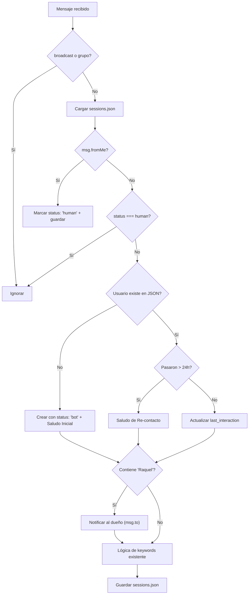

# Walkthrough: Sistema de Gestión de Sesiones

## Archivos creados/modificados

| Archivo | Acción | Descripción |
|---|---|---|
| [sessionManager.ts](file:///c:/Users/Andres/Documents/proyectos/proyecto-attclient/src/services/sessionManager.ts) | **NEW** | Módulo con [loadSessions()](file:///c:/Users/Andres/Documents/proyectos/proyecto-attclient/src/services/sessionManager.ts#22-35), [saveSessions()](file:///c:/Users/Andres/Documents/proyectos/proyecto-attclient/src/services/sessionManager.ts#36-42), interfaces y constante `TWENTY_FOUR_HOURS` |
| [sessions.json](file:///c:/Users/Andres/Documents/proyectos/proyecto-attclient/sessions.json) | **NEW** | Archivo JSON inicial vacío `{}` |
| [index.ts](file:///c:/Users/Andres/Documents/proyectos/proyecto-attclient/src/index.ts) | **MODIFIED** | Integración completa del sistema de sesiones en `client.on('message')` |

## Flujo lógico implementado

## Consideraciones técnicas

- **Timestamps**: Se usa `Math.floor(Date.now() / 1000)` para convertir ms → s y comparar con los timestamps de WhatsApp.
- **I/O asíncrono**: Se usan `fs.promises` para no bloquear el event loop.
- **Ruta del JSON**: Se resuelve con `path.resolve(__dirname, '../../sessions.json')` relativa al directorio del módulo compilado.

## Verificación

- ✅ `npm run build` — compilación exitosa sin errores de TypeScript.
