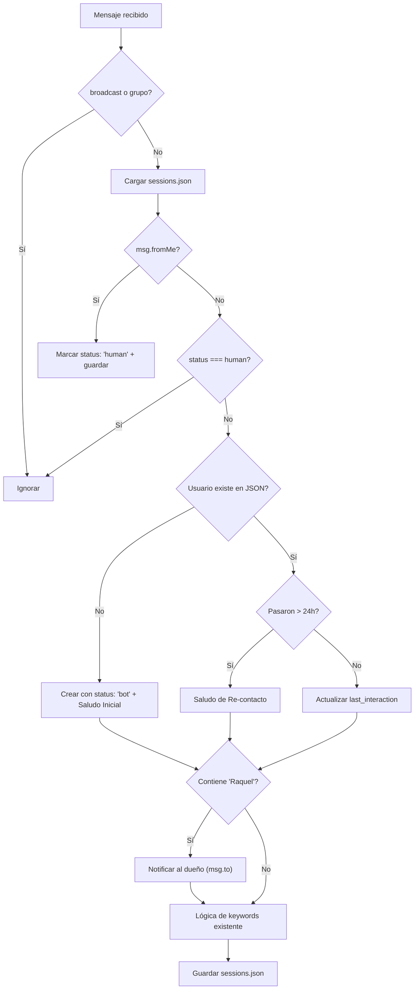

# Walkthrough: Sistema de Gestión de Sesiones

## Archivos creados/modificados

| Archivo | Acción | Descripción |
|---|---|---|
| [sessionManager.ts](file:///c:/Users/Andres/Documents/proyectos/proyecto-attclient/src/services/sessionManager.ts) | **NEW** | Módulo con [loadSessions()](file:///c:/Users/Andres/Documents/proyectos/proyecto-attclient/src/services/sessionManager.ts#22-35), [saveSessions()](file:///c:/Users/Andres/Documents/proyectos/proyecto-attclient/src/services/sessionManager.ts#36-42), interfaces y constante `TWENTY_FOUR_HOURS` |
| [sessions.json](file:///c:/Users/Andres/Documents/proyectos/proyecto-attclient/sessions.json) | **NEW** | Archivo JSON inicial vacío `{}` |
| [index.ts](file:///c:/Users/Andres/Documents/proyectos/proyecto-attclient/src/index.ts) | **MODIFIED** | Integración completa del sistema de sesiones en `client.on('message')` |

## Flujo lógico implementado

## Resumen de Cambios Completados

### Fase 1: Entorno de Desarrollo y Estáticos
- [x] Convertir `index.js` del backend a ES Modules o configurar el `package.json` de manera acorde (usamos CommonJS en un inicio pero terminamos usando `type: "module"`)
- [x] Configurar `tsc` para transpilar código TypeScript de Node
- [x] Configurar nodemon en modo watch para recargar el backend al editar el código

### Fase 2: Configuración de Firebase y Base de Datos (Firestore)
- [x] Añadida librería `firebase-admin` al servidor Express
- [x] Definido un esquema de datos en Firestore para `usuarios`, `bots`, y `metricas`
- [x] Modificadas las funciones de persistencia para leer/guardar directamente en Firebase

### Fase 3: Pasarela de Pagos (Mockup y Diseño base)
- [x] Creación de `src/services/paymentService.ts`
- [x] Implementar rutas ficticias para simular subscripciones (crear checkout y webhook mock)

### Fase 4: Frontend Principal (Migrado a Vite + React)
- [x] Se inicializó un proyecto unificado de React + Vite en la carpeta `landing/`
- [x] Se migró `index.html` estático a un diseño moderno de React con Tailwind (landing page en `Landing.tsx`)
- [x] Se migró el panel de administrador SaaS de Vanilla JS a React (`SaasDashboard.tsx`)
- [x] Se migró el panel de administrador del Bot de Vanilla JS a React (`BotAdmin.tsx`)
- [x] Se migró la página de Login unificada hacia React (`LoginView.tsx`)
- [x] Se configuraron rutas en App.tsx con protección de AuthState
- [x] Se actualizó `server.ts` del backend para servir únicamente los archivos estáticos desde `landing/dist` para todo salvo las rutas del `/api`.
- [x] Se eliminaron las carpetas `public/`, `admin/` y `users/` con los archivos HTML obsoletos.
- [x] Se actualizaron los scripts `npm run dev` y `npm run build` para usar `concurrently` y construir/servir conjuntamente el frontend y backend.

## Consideraciones técnicas

- **Timestamps**: Se usa `Math.floor(Date.now() / 1000)` para convertir ms → s y comparar con los timestamps de WhatsApp.
- **I/O asíncrono**: Se usan `fs.promises` para no bloquear el event loop.
- **Ruta del JSON**: Se resuelve con `path.resolve(__dirname, '../../sessions.json')` relativa al directorio del módulo compilado.

## Verificación

- ✅ `npm run build` — compilación exitosa sin errores de TypeScript.
